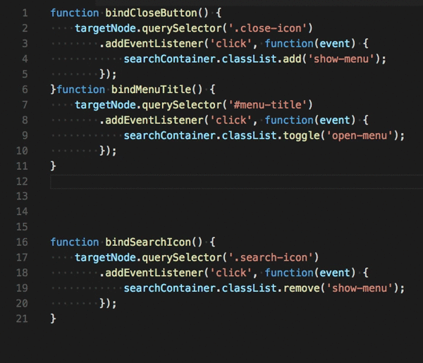

# Blank Line Organizer Reborn

This extension will help you organize blank lines in the code by removing multiple blank lines. The extension removes blank lines only from the selected lines if any, otherwise from the entire file.

## Thanks 
[original project](https://github.com/rintoj/blank-line-organizer) by [rintoj](https://github.com/rintoj)

## Demo

## Usage

Press `Ctrl + ;` / `Cmd + ;`

or

Enter `Ctrl/Cmd + P` search for `> Remove blank lines`

## Configuration

| Configuration                   | Type      | Default Value | Description
| ------------------------------- | --------- | ------------- | -----------------------------
| blankLine.keepOneEmptyLine      | `boolean` | `true`        | Set to false to remove all blank lines or true to keep one.
| blankLine.triggerOnSave         | `boolean` | `true`        | If set to true, the command will be triggered on save.
| blankLine.insertLineAfterBlock  | `boolean` | `true`        | If set to true, inserts an blank line after a block statement. This has no effect if `keepOneEmptyLine` is set to `false`.
| blankLine.languageIds           | `string[]`| `["javascript", "typescript", "json", "css", "scss"]` | Trigger this command on save, only if current language-id is in the list

NOTE: By default the extension is configured to format on save, you can disable this by setting `blankLine.triggerOnSave` to `false`.

## Contributing

Contributions are very welcome! Just send a pull request. Feel free to contact me or checkout my [Github](https://github.com/rintoj/blank-line-organizer) page.

